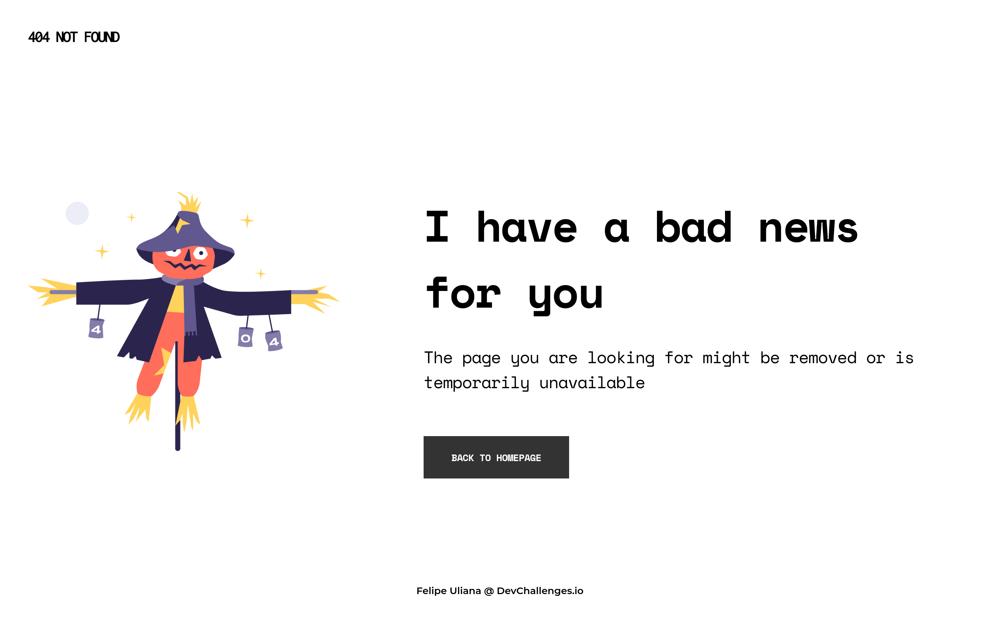

# DevChallenge - 404 not found page

Solution for a challenge from [Devchallenges.io](http://devchallenges.io).

### [Demo](https://felipeuliana.github.io/devchallenges-404-not-found/) | [Solution](https://github.com/felipeuliana/devchallenges-404-not-found}) | [Challenge](https://devchallenges.io/challenges/wBunSb7FPrIepJZAg0sY)

## Table of Contents

- [Overview](#overview)
  - [Built With](#built-with)
- [Features](#features)
- [Contact](#contact)
- [Acknowledgements](#acknowledgements)

## Overview

Here you can see the [demo](https://felipeuliana.github.io/devchallenges-404-not-found/) that I developed for the _DevChallenge 404 Not Found Page_.

It was a good firt experience at _DevChallenge_, where I can pratice some layout techniques.

And with it I could test a little of display grid and flex, and a bit of BEM, and Github Pages.

### Built With

[HTML](https://developer.mozilla.org/en-US/docs/Web/HTML) and [CSS](https://developer.mozilla.org/en-US/docs/Web/CSS) purely.

## Features

This application/site was created as a submission to a [DevChallenges](https://devchallenges.io/challenges) challenge. The [challenge](https://devchallenges.io/challenges/wBunSb7FPrIepJZAg0sY) was to build an application to complete the given user stories:

__User story__: I can see a page following the given design

## Acknowledgements

- [Steps to replicate a design with only HTML and CSS](https://devchallenges-blogs.web.app/how-to-replicate-design/)

## Contact

- GitHub [@felipeuliana](https://github.com/felipeuliana)
